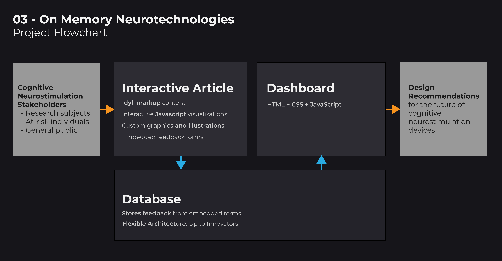

# On Memory Neurotechnologies
An interactive article on memory neurotechnologies created for the 2020 NeuroNexus Design Competition
 
## Contributors

## Goals
1. Create an interactive article that explains the hippocampal memory prosthesis being developed at the USC Neural Modeling and Computation Lab.
2. Deploy this article for gathering qualitative research on reader (e.g. patient and public) perspectives on future cognitive neurotechnologies. 
3. Release preliminary design recommendations for such devices.

## Project Requirements

### Article Outline
1. Introduction to Cognition and Memory Disorders
- Inability to encode new memories
2. The Memory Prosthesis
- History and theory
- Math
3. The Experimental Paradigm
- Experiential walkthrough
4. The Results
- See (Hampson et al. 2018)
5. The Future User Experience
- The need for qualitative research
6. Conclusion

## Preamble
It is becoming increasingly accepted that user-centered design is critical for the 
development of effective neurotechnology devices. However, researchers remain 
skeptical about using qualitative feedback to guide low-level technical decisions 
for early-stage devices. We will evaluate the effectiveness of interactive media to 
source useful feedback from non-expert stakeholders (i.e. patients and the public) 
on memory neurotechnologies—particularly our own proof-of-concept neurostimulation 
device for restoring memory function in dementia.

We will design and produce an interactive explanation of our hippocampal memory 
prosthesis. This will take the form of an interactive website 
(e.g. [On Particle Physics](https://parametric.press/issue-01/on-particle-physics/)) 
that contains explorable explanations of Alzheimer’s disease, brain stimulation 
therapies, and our neurostimulation device for memory restoration. 
Our website will collect reader feedback through embedded feedback forms, 
then organize such feedback on a researcher dashboard for qualitative analysis.
 We will launch this website at the conclusion of the 2020 NeuroNexus competition 
 and leverage user feedback to create design recommendations for the future of 
 cognitive neurostimulation.

## Appendix: Idyll Documentation
 
### Quick Start
* The multipage template uses an index, or main, page (in this directory) alongside multiple sub-pages (in the `posts` directory).  
* To run the main page, use the `idyll` command in this directory.  
* To create a new page, `cd posts` to navigate to the `posts` directory, then use `idyll create --template ../template --no-install` to create a new post.  
* To run a sub-page, `cd posts/name-of-page` to navigate to that page's directory, then use `idyll`.  
* Any pages that have been built will go to the `docs` directory (found within the top level of the multipage post).

### Project overview

- `posts` - all of the available posts, each directory within contains a full idyll post
- `components` - shared components, can be used by any post. Each post also has its own components folder where you can put components that don't need to be shared.
- `template` - the post template to use when you run `idyll create`. Update this template with site specific styles, configuration, etc.
- `index.idyll` - the root/index page for the blog. Note this is not autogenerated.
- `docs` - the folder where the output is built. Deploy to any static hosting service (we name it `docs` so its easy to host on github pages).

## Installation

- Make sure you have `idyll` installed (`npm i -g idyll`).
- Clone this repo and run `npm install`.

## Creating a post

Navigate to the `posts` directory and run `idyll create --template ../template/ --no-install`. 
Alternatively, use `idyll create`, select `Custom` for the template when prompted, and provide the path `../template/`.

Using the `idyll create` command without one of the other templates will work, but the above will automatically follow the default structure of the multipage post, while the other preset templates will not.
If you do choose to use another template, your build files will go to `posts/name-of-post/build/` instead of `docs/name-of-post/`.

To change the output location, change the `output` option in `package.json` in the template directory (if using the provided template) and at the root of this project (and any existing posts!).

## Developing a post locally

Navigate to the post's directory and run `idyll`.

## Developing the index page

Navigate to the root of this project and run `idyll`.

## Building a post for production

Navigate to the post's directory and run \`idyll build\`. The output will appear in the top-level \`docs\` folder. 
To change the output location, change the \`output\` option in \`package.json\` in the template directory and at the root of this project (and any existing posts!).
(This assumes that you are using the template provided for multipage blogs.)

## Deploying

Make sure all of your posts have been built, then deploy the docs folder via any static hosting service.

## Dependencies

You can install custom dependencies on a per-post basis by running `npm install <package-name> --save` in the post directory. Note that any collaborators will also need download the package locally by running `npm install` after pulling the changes.
